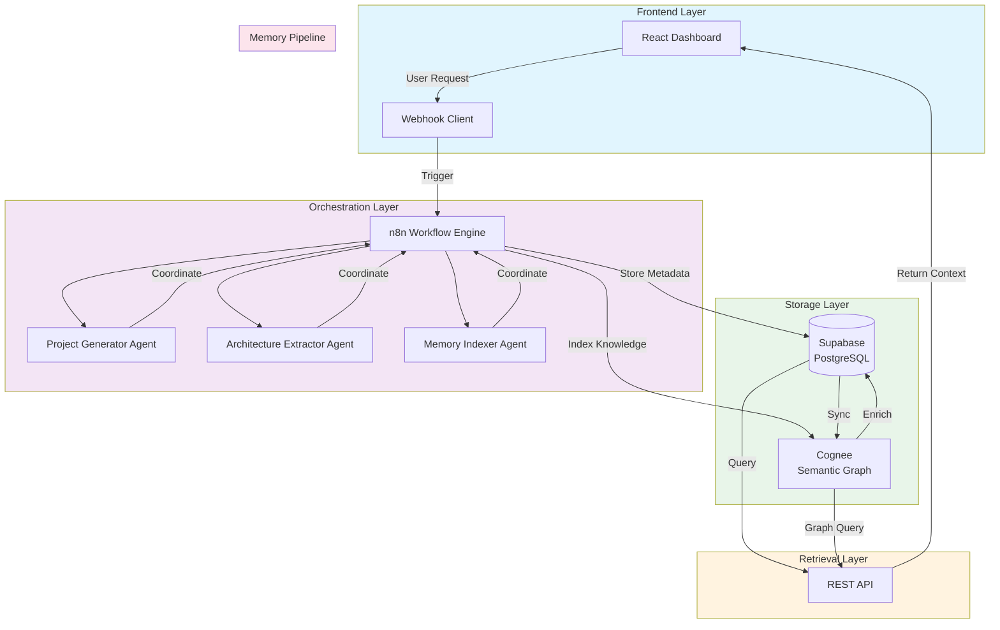
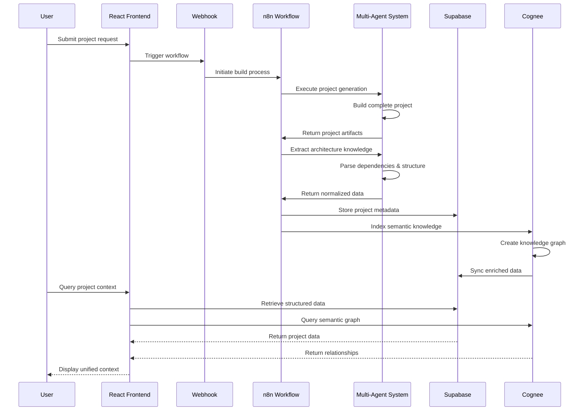

# ContextOS

> **Intelligent Project Workspace with Persistent Semantic Memory**

[](https://opensource.org/licenses/MIT)
[](https://reactjs.org/)
[](https://www.typescriptlang.org/)
[](https://supabase.com/)
[](https://n8n.io/)
[](https://cognee.ai/)

---

## 📋 Problem Statement

**Generated project knowledge is ephemeral.** When AI agents generate software projects, the architectural decisions, dependency relationships, and implementation context are typically lost after [...]

This creates a significant knowledge gap:
- ❌ No traceability of design decisions
- ❌ Lost context for future modifications
- ❌ Inability to query project architecture
- ❌ No semantic understanding of component relationships
- ❌ Manual documentation that quickly becomes outdated

---

## 💡 Solution

**ContextOS** bridges the gap between AI-powered project generation and persistent architectural memory. Our platform orchestrates a multi-agent workflow that not only generates software projects [...]

### How It Works

1. **Generate** - Multi-agent system builds complete software projects
2. **Extract** - Architecture, dependencies, and relationships are captured
3. **Index** - Knowledge is embedded into a semantic graph using Cognee
4. **Retrieve** - Query project context through natural language or structured queries
5. **Visualize** - Explore relationships through interactive knowledge graphs

---

## 🏗️ System Architecture



---

## ✨ Key Features

| Feature | Description |
|---------|-------------|
| 🤖 **Multi-Agent Orchestration** | Coordinated workflow across specialized agents for project generation, extraction, and indexing |
| 🧠 **Semantic Memory Graph** | Project knowledge stored as interconnected nodes in a semantic graph using Cognee |
| 🔄 **Automated Workflow** | End-to-end automation from request submission to knowledge indexing |
| 💾 **Persistent Storage** | All project metadata and architecture stored in Supabase PostgreSQL |
| 🔍 **Context-Aware Retrieval** | Query project knowledge through natural language or structured queries |
| 📊 **Relationship Visualization** | Interactive graph visualization of project dependencies and architecture |
| 🎯 **Real-Time Monitoring** | Track workflow execution and agent activity in real-time |
| 🔗 **Memory Synchronization** | Continuous sync between structured storage and semantic graph |

---

## 🔄 Workflow Overview



---

## 🧩 Technical Challenges Solved

### 🔀 Dynamic Payload Normalization
- Implemented flexible data transformation pipelines
- Handled heterogeneous agent outputs with unified schemas
- Built robust validation and error handling for malformed data

### 🔗 Webhook Orchestration
- Designed resilient webhook architecture for agent communication
- Implemented retry logic and failure handling
- Created event-driven workflow triggering system

### 🤖 Multi-Agent Workflow Coordination
- Coordinated asynchronous agent operations
- Managed state persistence across agent interactions
- Implemented dependency resolution between agents

### 💾 Memory Persistence
- Designed schema for flexible project knowledge storage
- Implemented versioning for architectural decisions
- Created efficient query patterns for project metadata

### 🔍 Semantic Retrieval
- Integrated Cognee for vector embeddings and graph construction
- Implemented hybrid search (semantic + structured)
- Created ranking system for relevant context retrieval

### 🔄 Data Synchronization
- Built bidirectional sync between Supabase and Cognee
- Implemented change detection and incremental updates
- Ensured consistency across storage systems

---

## 📸 Project Screenshots

### 🖥️ Frontend Dashboard
```
┌─────────────────────────────────────────────────┐
│  CONTEXTOS  ▼  Dashboard  Projects  Knowledge   │
├─────────────────────────────────────────────────┤
│  ┌─────────────┐  ┌─────────────┐              │
│  │ Active       │  │ Projects    │              │
│  │ Workflows    │  │ 12 Total    │              │
│  │ 3 Running    │  │ 8 Completed │              │
│  └─────────────┘  └─────────────┘              │
│                                                  │
│  Recent Projects:                                │
│  ┌──────────────────────────────────────────┐   │
│  │ 🚀 E-Commerce API    ⏱ 2 min ago       │   │
│  │ 📊 Analytics Pipeline ⏱ 1 hour ago     │   │
│  │ 🤖 ML Service         ⏱ 3 hours ago    │   │
│  └──────────────────────────────────────────┘   │
│                                                  │
│  [New Project]  [View Knowledge Graph]          │
└─────────────────────────────────────────────────┘
```

### ⚙️ Workflow Execution
```
┌─────────────────────────────────────────────────┐
│  WORKFLOW: Project Generation #42               │
├─────────────────────────────────────────────────┤
│  ✅ Project Generator   │ 2.3s   │ Complete   │
│  ✅ Architecture Extr.  │ 1.1s   │ Complete   │
│  🔄 Memory Indexer      │ 67%    │ Running    │
│  ⏳ Semantic Embedding   │ 0%     │ Queued    │
│  ⏳ Graph Construction   │ 0%     │ Queued    │
├─────────────────────────────────────────────────┤
│  🔍 Extracted 142 components                   │
│  📊 Found 387 dependencies                     │
│  🧠 Indexing 54 nodes                         │
└─────────────────────────────────────────────────┘
```

### 🕸️ Cognee Knowledge Graph
```
        ┌──────────────────────────────┐
        │    📦 Project: "ContextOS"   │
        └──────────┬───────────────────┘
                   │
        ┌──────────▼──────────┐
        │   📁 /src           │
        └──────┬──────────────┘
               │
    ┌──────────┼──────────┐
    │          │          │
┌───▼───┐ ┌───▼───┐ ┌───▼────┐
│📄 App │ │📁 api │ │📁 auth │
└───┬───┘ └───┬───┘ └───┬────┘
    │         │         │
    └─────────┼─────────┘
              │
        ┌─────▼─────┐
        │ 🔗 React  │
        │ ⚛️ v18.2  │
        └───────────┘
```

### 🔍 Memory Retrieval
```
┌─────────────────────────────────────────────────┐
│  🔍 Query: "How does authentication work?"      │
│  [Search]  [Semantic]  [Graph]                  │
├─────────────────────────────────────────────────┤
│  Results (3 found):                             │
│                                                  │
│  📌 JWT Authentication Flow                     │
│     • AuthProvider wraps App component         │
│     • useAuth hook provides session            │
│     • Tokens stored in Supabase sessions       │
│     🔗 Related: auth.service.ts                │
│                                                  │
│  📌 Session Management                          │
│     • Managed via Supabase Auth                │
│     • Persisted in PostgreSQL                  │
│     • Refresh token rotation                   │
│     🔗 Related: middleware.ts                  │
│                                                  │
│  📌 Permission Middleware                       │
│     • Role-based access control                │
│     • Route protection                         │
│     • API guard implementation                 │
│     🔗 Related: permissions.json               │
└─────────────────────────────────────────────────┘
```

---

## 🛠️ Tech Stack

| Category | Technology | Purpose |
|----------|-----------|---------|
| **Frontend** | React 18 + TypeScript | UI dashboard and user interaction |
| **Workflow Engine** | n8n | Workflow automation and agent orchestration |
| **Agent Communication** | Webhooks | Asynchronous agent coordination |
| **Primary Database** | Supabase (PostgreSQL) | Persistent project metadata and structured storage |
| **Semantic Memory** | Cognee | Knowledge graph construction and semantic retrieval |
| **APIs** | REST + WebSocket | Data access and real-time updates |
| **Languages** | TypeScript, JavaScript | Type-safe application code |
| **Graph Visualization** | Cytoscape.js / D3.js | Interactive knowledge graph rendering |
| **State Management** | Zustand / React Query | Client-side state and caching |
| **Authentication** | Supabase Auth | User management and access control |

---

## 🚀 Future Improvements

### 🔮 Advanced Agent Collaboration
- Implement agent-to-agent communication protocols
- Add specialized agents for different project types (microservices, monoliths, serverless)
- Enable parallel agent execution for faster workflows

### 🎨 Enhanced Visualization
- Render files and code previews directly in the UI
- Interactive exploration of repository structure
- Real-time collaborative graph exploration

### 📊 Graph Intelligence
- Advanced graph algorithms for pattern detection
- Predictive architecture suggestions
- Anomaly detection in project structures

### 🔒 Multi-Tenancy
- Isolated memory for different projects
- Fine-grained access controls
- Project-level permission management

### 🎯 Retrieval Optimization
- Fine-tuned ranking algorithms
- Hybrid retrieval strategies (BM25 + vector + graph)
- Caching layer for frequent queries

### 🔄 Integration Ecosystem
- GitHub/GitLab integration for repository sync
- CI/CD pipeline integration
- IDE plugins for real-time context retrieval

---

## 📚 What I Learned

### 🔄 Workflow Automation
- Designing resilient, fault-tolerant workflows
- Managing state across distributed services
- Implementing idempotent operations

### 🧠 Memory Systems
- Understanding vector embeddings and semantic search
- Graph database concepts and query patterns
- Trade-offs between structured and unstructured storage

### 📊 Data Pipelines
- Building robust ETL processes for knowledge extraction
- Handling heterogeneous data formats
- Ensuring data consistency across systems

### 🔍 Semantic Indexing
- Implementing retrieval-augmented generation concepts
- Optimizing embedding quality and retrieval speed
- Balancing precision and recall in search

### 🌐 Distributed Architecture
- Service communication patterns
- Event-driven architecture design
- Monitoring and observability practices

### 🔌 Integration Engineering
- Working with diverse APIs and SDKs
- Webhook event handling and security
- Error handling and recovery strategies

---

## 📁 Repository Structure

```
contextos/
├── frontend/
│   ├── src/
│   │   ├── components/
│   │   │   ├── Dashboard/
│   │   │   ├── Workflow/
│   │   │   ├── Graph/
│   │   │   └── Projects/
│   │   ├── hooks/
│   │   ├── services/
│   │   │   ├── api/
│   │   │   └── websocket/
│   │   ├── store/
│   │   ├── types/
│   │   └── utils/
│   ├── public/
│   └── package.json
│
├── workflows/
│   ├── n8n/
│   │   ├── templates/
│   │   ├── agents/
│   │   └── webhooks/
│   └── schemas/
│
├── agents/
│   ├── generator/
│   ├── extractor/
│   └── indexer/
│
├── backend/
│   ├── api/
│   ├── supabase/
│   │   ├── migrations/
│   │   └── functions/
│   └── cognee/
│       ├── embeddings/
│       ├── graphs/
│       └── queries/
│
├── scripts/
├── docs/
├── tests/
├── docker-compose.yml
├── .env.example
└── README.md
```

---

## 🎬 Demo Video

🎥 **[Watch the ContextOS Demo](https://youtu.be/demo-video-link)**

*Coming soon – See the full workflow in action!*

---

## 🙏 Acknowledgements

- **[React](https://reactjs.org/)** – The UI framework powering our dashboard
- **[n8n](https://n8n.io/)** – The workflow automation engine orchestrating our agents
- **[Supabase](https://supabase.com/)** – The PostgreSQL platform storing our project knowledge
- **[Cognee](https://cognee.ai/)** – The semantic memory system indexing our knowledge graph
- **All open-source contributors** who make tools like these possible

---

## 📄 License

This project is [MIT licensed](LICENSE).

---

## 🤝 Contributing

We welcome contributions! Please see our [Contributing Guide](CONTRIBUTING.md) for details.

---

## 📬 Contact

- **Project Lead**: Yug Agrawal
- **Email**: yugagrawalmng@gmail.com
- **GitHub**: YUG634
- **Linkedin**: www.linkedin.com/in/yug-agrawal-101bb11a0


---

<div align="center">
  <b>Built for the Hangover hackathon with ❤️ by Yug Agrawal </b>
</div>
